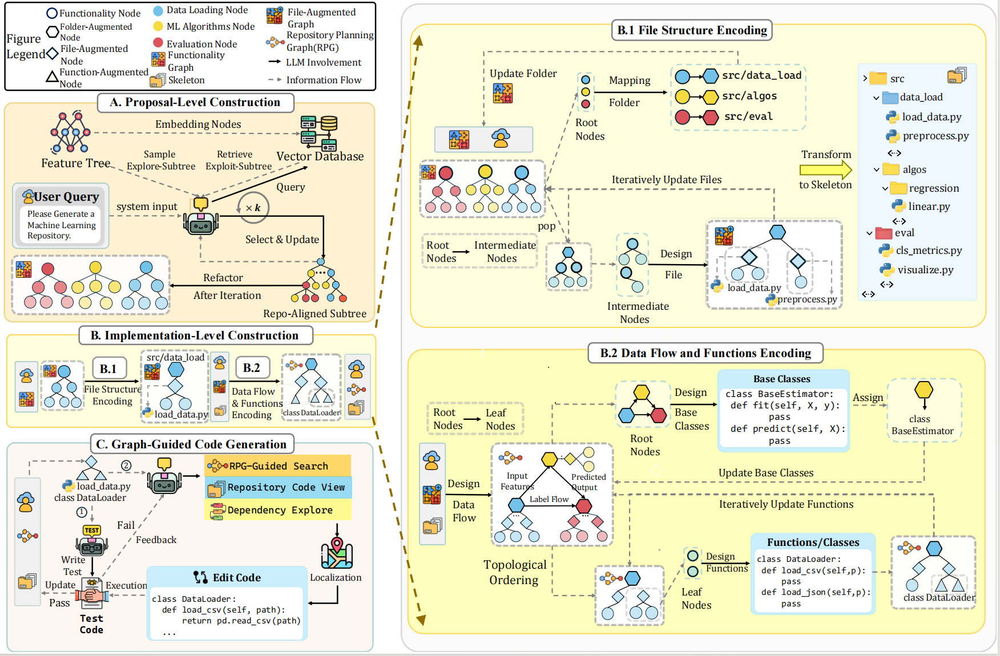

# RPG-ZeroRepo

[](https://arxiv.org/abs/2509.16198)
[](https://www.python.org/downloads/) [](https://opensource.org/licenses/MIT)

**RPG (Repository Planning Graph)** is a hierarchical graph representation that captures both the *functional* view (features, requirements) and the *structural* view (files, classes, functions, dependencies) of a software repository. **ZeroRepo** is an LLM-driven framework built on RPG that **generates a complete software repository from a natural-language description** -- given a short project overview (e.g. "a multiplayer snake game"), it constructs an RPG through feature planning and architecture design, then iteratively writes and tests every source file, all automatically.

The pipeline has three sequential phases:



## News and Updates
---
- [Coming Soon] An RPG-based plugin for Claude Code is under active development and will be open-sourced once ready.
- [2026-02-27] 🔥 We have released code of the [RPG-Encoder](zerorepo/rpg_encoder/) and [RepoCraft](repocraft/).
- [2026-02-12] 🔥 We have open-sourced the ZeroRepo codebase. RPG-Encoder is currently going through the open-source release process and will be released once the process is complete.
- [2026.02.02] 🔥 Our paper "[Closing the Loop: Universal Repository Representation with RPG-Encoder](https://arxiv.org/abs/2602.02084)" has been released on arXiv.
- [2026.01.26] 🔥 [RPG-ZeroRepo](https://arxiv.org/abs/2509.16198) has been accepted as a poster at ICLR 2026.
- [2025.09.19] 🔥 Our paper "[RPG: A Repository Planning Graph for Unified and Scalable Codebase Generation](https://arxiv.org/abs/2509.16198)" has been released on arXiv.


## Table of Contents

- [Quick Start](#quick-start)
- [Phase 1 -- Property Level (Feature Planning)](#phase-1----property-level-feature-planning)
- [Phase 2 -- Implementation Level (Architecture Design)](#phase-2----implementation-level-architecture-design)
- [Phase 3 -- Code Generation (Iterative Implementation)](#phase-3----code-generation-iterative-implementation)
- [Checkpoint & Resume](#checkpoint--resume)
- [Intermediate Files Reference](#intermediate-files-reference)
- [Configuration](#configuration)
- [RPG-Encoder](#rpg-encoder) -- RPG extraction, incremental maintenance, and agentic navigation ([detailed docs](zerorepo/rpg_encoder/README.md))
- [RepoCraft Benchmark](#repocraft-benchmark) -- Benchmark construction and evaluation for repo-level code generation ([detailed docs](repocraft/README.md))

---

## Quick Start

### 1. Prepare project directory

Create a project directory **outside of any existing git repository**. ZeroRepo uses git internally to track each implementation step in `workspace/` -- placing it inside an existing repo will cause conflicts.

```
my_project/                  # Must NOT be inside a git repo
├── checkpoints/             # Pipeline state & design artifacts (auto-populated)
│   └── repo_data.json       # You create this (see below)
└── workspace/               # Generated repository (auto-initialized as a git repo)
```

```bash
mkdir -p my_project/checkpoints my_project/workspace
```

Then write `checkpoints/repo_data.json` describing the project you want to generate:

```json
{
  "repository_name": "SnakeGame",
  "repository_purpose": "A multiplayer snake game with AI opponents, pathfinding, replay recording, and persistent high scores."
}
```

### 2. Configure

Edit `configs/zerorepo_config.yaml` -- set your LLM provider, model, and authentication. Edit `configs/trae_config.yaml` for the code-gen agent's LLM.

### 3. Run

```bash
# Run the full pipeline (design + implementation)
python main.py \
  --config configs/zerorepo_config.yaml \
  --checkpoint ../my_project/checkpoints \
  --repo ../my_project/workspace \
  --phase all \
  --resume
```

Or use the provided script:

```bash
bash scripts/run_main.sh
```

The pipeline is **fully resumable** -- if interrupted, rerun with `--resume` to continue from the last completed stage.

### 4. Output

```
my_project/
  checkpoints/          # Intermediate files (design artifacts, state)
  workspace/            # The generated repository (git-initialized)
    src/
    tests/
    README.md
    ...
```

---

## Phase 1 -- Property Level (Feature Planning)

**Module:** `zerorepo/rpg_gen/prop_level/`
**Entry:** `PropBuilder.build_feature_tree()`

This phase transforms a high-level project description into a structured feature hierarchy and component decomposition.

### Step 1: Feature Selection

**Agent:** `FeatureSelectAgent`

Takes the `repository_purpose` text and generates a comprehensive **Feature Tree** -- a hierarchical taxonomy of everything the project should do.

```
Input:  "A multiplayer snake game with AI opponents..."

Output: Feature_tree
        ├── functionality
        │   ├── game mechanics: [movement, collision detection, food spawning, scoring]
        │   ├── ai opponent: [strategy, training]
        │   └── level generation: [static layout, procedural maze, dynamic obstacles]
        ├── algorithm
        │   ├── pathfinding: [astar, bfs flood fill, monte carlo rollouts]
        │   └── optimization: [caching, incremental updates, memory management]
        ├── data structures
        │   ├── grid management: [occupancy map, compact bitset, quadtree index]
        │   └── snake body: [ring buffer segments, delta encoding, serialization]
        └── ...
```

**Saved to:** `checkpoints/feature_selection.json`

### Step 2: Feature Refactoring

**Agent:** `FeatureRefactorAgent`

Groups the flat feature tree into **Components** -- logical modules that will become top-level source directories.

```
Input:  Feature_tree (above)

Output: Components
        ├── gameplay.core     → game mechanics, rules, levels
        ├── simulation.engine → deterministic tick, physics, timing
        ├── data.model        → grid structures, snake body, caching
        ├── ai.pathfinding    → pathfinding, opponent AI, training
        ├── io.input_persistence → input handling, file I/O, replay
        └── network.multiplayer  → transport, netcode, matchmaking
```

**Saved to:** `checkpoints/feature_refactoring.json`

### Output

The combined result is written to `checkpoints/repo_data.json`:

```json
{
  "repository_name": "SnakeGame",
  "repository_purpose": "...",
  "Feature_tree": { ... },
  "Component": [
    {
      "name": "gameplay.core",
      "refactored_subtree": {
        "gameplay": {
          "rules": ["movement", "collision detection", "scoring"],
          "levels": ["static layout", "procedural generation"]
        }
      }
    },
    ...
  ]
}
```

---

## Phase 2 -- Implementation Level (Architecture Design)

**Module:** `zerorepo/rpg_gen/impl_level/`
**Entry:** `ImplBuilder.run()`

This phase turns the feature plan into concrete file layouts, interface designs, and implementation tasks.

### Step 1: Create Initial RPG

Builds the initial **Repository Planning Graph (RPG)** from Component data. Each component becomes a directory node, features become leaf nodes.

**Saved to:** `checkpoints/global_repo_rpg.json`

### Step 2: File Design (Skeleton)

**Agent:** `FileDesigner` (via `RawSkeletonAgent` + `GroupSkeletonAgent`)

Two sub-phases:
1. **Raw Skeleton** -- LLM generates a high-level file/directory layout
2. **Group Skeleton** -- assigns features to concrete file paths, adds `__init__.py` files

```
Output: RepoSkeleton (76 files for SnakeGame example)
        SnakeGame/
        ├── src/
        │   ├── ai/
        │   │   ├── analysis.py
        │   │   ├── planning/
        │   │   │   ├── pathfinding.py
        │   │   │   ├── heuristics.py
        │   │   │   └── simulation.py
        │   │   └── opponent/strategies.py
        │   ├── gameplay/
        │   │   ├── rules/{movement,collision,input}.py
        │   │   └── levels/{layout,procedural}.py
        │   ├── data/model/{memory,cache,segments}.py
        │   ├── io/persistence/serialization.py
        │   ├── simulation/engine/{deterministic,random}.py
        │   └── network/transport/{reliability,aggregation}.py
        ├── tests/    (mirrored structure)
        └── pyproject.toml, README.md, ...
```

**Saved to:** `checkpoints/skeleton.json`, `checkpoints/skeleton_traj.json`

### Step 3: Function Design (Interface)

**Agent:** `FuncDesigner` (via `DataFlowAgent` + `BaseClassAgent` + `InterfaceAgent`)

Three sub-phases:
1. **Data Flow Analysis** -- identifies data dependencies between components
2. **Base Class Design** -- designs shared data structures and base classes
3. **Interface Design** -- for each file (in topological order), designs classes/functions with full signatures, docstrings, and type hints

```
Output per file:
{
  "src/io/persistence/serialization.py": {
    "file_code": "class HighScoreBinarySerializer:\n    def serialize(self, entries) -> bytes: ...\n    ...",
    "units": ["class HighScoreBinarySerializer"],
    "units_to_features": {
      "class HighScoreBinarySerializer": ["high score binary serialization"]
    },
    "units_to_code": {
      "class HighScoreBinarySerializer": "class HighScoreBinarySerializer:\n    ..."
    }
  }
}
```

**Saved to:** `checkpoints/graph.json`, `checkpoints/global_repo_rpg.json` (updated)

### Step 4: Task Planning

**Agent:** `TaskPlanner`

Splits the interface designs into **implementation batches** -- one per file, each containing the units (classes/functions) to implement, their skeleton code, and feature descriptions.

```
Output: tasks.json
{
  "planned_batches_dict": {
    "io.input_persistence": {
      "src/io/persistence/serialization.py": [
        {
          "task_id": "src_io_persistence_serialization.py_...",
          "file_path": "src/io/persistence/serialization.py",
          "units_key": ["class HighScoreBinarySerializer"],
          "unit_to_code": { ... },
          "unit_to_features": { ... },
          "priority": 0,
          "subtree": "io.input_persistence",
          "task_type": "implementation"
        }
      ],
      "src/io/levels/portable.py": [...],
      ...
    },
    "gameplay.core": { ... },
    ...
  }
}
```

**Saved to:** `checkpoints/tasks.json`

---

## Phase 3 -- Code Generation (Iterative Implementation)

**Module:** `zerorepo/code_gen/`
**Entry:** `IterativeCodeGenerator.task_executor()`

This phase executes each task batch inside a **Docker container** running the trae-agent (an LLM-powered coding agent), using a test-driven development (TDD) loop.

### Per-Batch Iterative Loop

For each task batch, the system runs up to `max_iterations` cycles:

```
Iteration N:
  ┌─────────────────────┐
  │ 1. Generate Tests   │  trae-agent writes test_xxx.patch
  │    (TDD first)      │  → git commit "test: add tests for ..."
  ├─────────────────────┤
  │ 2. Generate Code    │  trae-agent writes code_xxx.patch
  │    (implementation) │  → git commit "feat: implement ..."
  ├─────────────────────┤
  │ 3. Run Tests        │  pytest inside container
  │    (validation)     │
  ├─────────────────────┤
  │ 4. Analyze Result   │
  │    ├─ PASS → done   │
  │    ├─ TEST_ERROR  → regenerate tests (go to 1)
  │    ├─ CODE_ERROR  → regenerate code  (go to 2)
  │    └─ ENV_ERROR   → fix environment
  └─────────────────────┘
```

### Workflow Types

| Type | Description | When Used |
|------|-------------|-----------|
| `TEST_DEVELOPMENT` | Write tests from scratch | First iteration |
| `TEST_FIX` | Fix failing tests | Test code has issues |
| `CODE_INCREMENTAL` | Implement code from scratch | First iteration |
| `CODE_BUG_FIX` | Fix code based on test failures | Code has bugs |
| `ENV_SETUP` | Install packages / fix imports | Environment issues |

### Results per Task

Each trae-agent invocation produces:

```
results/
├── test_gen_1770643795/
│   ├── task.txt                      # Task description sent to agent
│   ├── test_gen_1770643795.json      # Full trajectory (LLM interactions)
│   └── test_gen_1770643795.patch     # Unified diff patch
├── code_gen_1770644020/
│   ├── task.txt
│   ├── code_gen_1770644020.json
│   └── code_gen_1770644020.patch
└── ...
```

### Commit Messages

After each successful patch, the system uses a separate LLM call to generate conventional commit messages:

```
test: add unit tests for HighScoreBinarySerializer
feat: implement HighScoreBinarySerializer binary encoding/decoding
fix: correct deserialization of optional player_name field
```

---

## Checkpoint & Resume

Every major stage writes its output to `checkpoints/` and updates `task_manager_state.json`. The pipeline can be resumed from any point.

### Stage Completion Tracking

```json
// task_manager_state.json
{
  "feature_selection": true,      // Phase 1, Step 1
  "feature_refactoring": true,    // Phase 1, Step 2
  "build_skeleton": true,         // Phase 2, Step 2
  "build_function": true,         // Phase 2, Step 3
  "plan_tasks": true,             // Phase 2, Step 4
  "code_generation": false,       // Phase 3 (in progress)
  "completed_tasks": ["batch_id_1", "batch_id_2"],
  "failed_tasks": [],
  "current_task": { ... },
  "last_updated": "2026-02-09T13:56:20"
}
```

When `--resume` is passed:
- Completed stages are skipped entirely
- Code generation resumes from the next uncompleted batch
- Failed batches can be retried

---

## Intermediate Files Reference

| File | Phase | Description |
|------|-------|-------------|
| `repo_data.json` | Input / Phase 1 | Repository name + purpose + Feature_tree + Components |
| `feature_selection.json` | Phase 1 | Raw feature tree from LLM |
| `feature_refactoring.json` | Phase 1 | Component decomposition results |
| `global_repo_rpg.json` | Phase 2 | Repository Planning Graph (full node/edge graph) |
| `skeleton.json` | Phase 2 | File/directory layout with code skeletons |
| `skeleton_traj.json` | Phase 2 | LLM trajectories from skeleton design |
| `graph.json` | Phase 2 | Complete interface design (data flow + base classes + per-file interfaces) |
| `tasks.json` | Phase 2 | Implementation task batches grouped by subtree and file |
| `cur_repo_rpg.json` | Phase 3 | Current RPG state (updated as code is generated) |
| `batch_trajectory.json` | Phase 3 | Execution records per batch (trajectories, commits, failures) |
| `execution_history.json` | Phase 3 | Flat list of all workflow executions |
| `iteration_state.json` | Phase 3 | Current iteration state for active batch |
| `task_manager_state.json` | All | Stage completion flags + task progress |

---

## Configuration

### `configs/zerorepo_config.yaml`

Controls the overall pipeline: LLM settings for design phases, prop-level parameters, impl-level config paths, Docker settings, and trae-agent options.

```yaml
llm:
  model: "gpt-5-mini-20250807"
  provider: "openai"
  api_key: "..."

prop_level:
  feature_selection:
    mode: "simple"         # "simple" or "feature" (multi-agent with vector DB)
  feature_refactoring:
    refactor_max_iterations: 40

impl_level:
  file_design_cfg_path: "configs/file_design_config.yaml"
  func_design_cfg_path: "configs/func_design_config.yaml"

code_generation:
  docker:
    image: "python-azure-pytest:3.12"
    container_name: "zerorepo_2"
    workspace: "/tare_workspace"
  trae_agent:
    trae_config: "./configs/trae_config.yaml"
    max_iterations: 5
    max_retries_per_workflow: 3
```

### `configs/trae_config.yaml`

Controls the coding agent (trae-agent) that runs inside Docker:

```yaml
model_providers:
  openai:
    provider: openai
    api_key: "..."

models:
  trae_agent_model:
    model_provider: openai
    model: gpt-5-mini-20250807
    max_completion_tokens: 16134
    temperature: 0.0

agents:
  trae_agent:
    model: trae_agent_model
    max_steps: 300
    tools: [bash, str_replace_based_edit_tool, sequentialthinking, task_done]
```

---

## RPG-Encoder

**Module:** `zerorepo/rpg_encoder/`
**Paper:** *"Closing the Loop: Universal Repository Representation with RPG-Encoder"* ([arXiv:2602.02084](https://arxiv.org/abs/2602.02084))

RPG-Encoder generalizes the Repository Planning Graph (RPG) from a static generative blueprint into a **unified, high-fidelity representation** for existing repositories. It closes the reasoning loop between comprehension and generation through three mechanisms:

| Mechanism | Module | Description |
|-----------|--------|-------------|
| **Encoding** | `rpg_parsing/` | Extracts RPG from raw codebases via semantic lifting, structure reorganization, and artifact grounding |
| **Evolution** | `rpg_parsing/rpg_evolution.py` | Incrementally maintains RPG via commit-level diff parsing, reducing overhead by 95.7% |
| **Operation** | `rpg_agent/` | Provides a unified agentic interface (SearchNode, FetchNode, ExploreRPG) for structure-aware navigation |

### Quick Start

```bash
# Parse a repository into RPG
python parse_rpg.py parse \
    --repo-dir /path/to/repo \
    --repo-name myrepo \
    --save-dir ./output

# Incrementally update after code changes
python parse_rpg.py update \
    --repo-dir /path/to/updated/repo \
    --last-repo-dir /path/to/old/repo \
    --load-path ./output/rpg_encoder.json \
    --save-dir ./output
```

See [`zerorepo/rpg_encoder/README.md`](zerorepo/rpg_encoder/README.md) for detailed documentation.

---

## RepoCraft Benchmark

**Module:** `repocraft/`
**Paper:** *"RPG: A Repository Planning Graph for Unified and Scalable Codebase Generation"* ([arXiv:2509.16198](https://arxiv.org/abs/2509.16198))

RepoCraft is a benchmark for evaluating **repository-level code generation**, consisting of **1,052 tasks** across 6 real-world Python projects (scikit-learn, pandas, sympy, statsmodels, requests, django). It assesses whether AI agents can generate repositories that are functionally complete, algorithmically correct, and at real-world scale.

| Metric | Description |
|--------|-------------|
| **Coverage** | Proportion of reference feature categories covered |
| **Accuracy** | Pass Rate (unit tests) and Voting Rate (semantic checks) |
| **Code Statistics** | File count, Lines of Code (LOC), Token count |

### Quick Start

```bash
# Build benchmark (parse → refactor → sample → generate queries)
python -m repocraft.benchmark pipeline \
    --repo_dir /path/to/scikit-learn \
    --output_dir ./all_results \
    --repo_name sklearn

# Evaluate a generated repository
python -m repocraft.run \
    --tasks_file ./all_results/task_results/sklearn.json \
    --method_path /path/to/generated/MLKit-Py \
    --cache_dir ./eval_cache

# Analyze results
python -m repocraft.evaluation --base-dir ./eval_cache --show-failed
```

See [`repocraft/README.md`](repocraft/README.md) for the full pipeline documentation.

---

## Acknowledgements
We thank the following projects for inspiration and valuable prior work that helped shape this project:
- Trae Agent: https://github.com/bytedance/trae-agent


## Cite & References
If this codebase is helpful to your research, we would appreciate it if you consider citing our paper. 
```
@article{luo2025rpg,
  title={RPG: A Repository Planning Graph for Unified and Scalable Codebase Generation},
  author={Luo, Jane and Zhang, Xin and Liu, Steven and Wu, Jie and Liu, Jianfeng and Huang, Yiming and Huang, Yangyu and Yin, Chengyu and Xin, Ying and Zhan, Yuefeng and others},
  journal={arXiv preprint arXiv:2509.16198},
  year={2025}
}

@article{luo2026closing,
  title={Closing the Loop: Universal Repository Representation with RPG-Encoder},
  author={Luo, Jane and Yin, Chengyu and Zhang, Xin and Li, Qingtao and Liu, Steven and Huang, Yiming and Wu, Jie and Liu, Hao and Huang, Yangyu and Kang, Yu and others},
  journal={arXiv preprint arXiv:2602.02084},
  year={2026}
}
```
