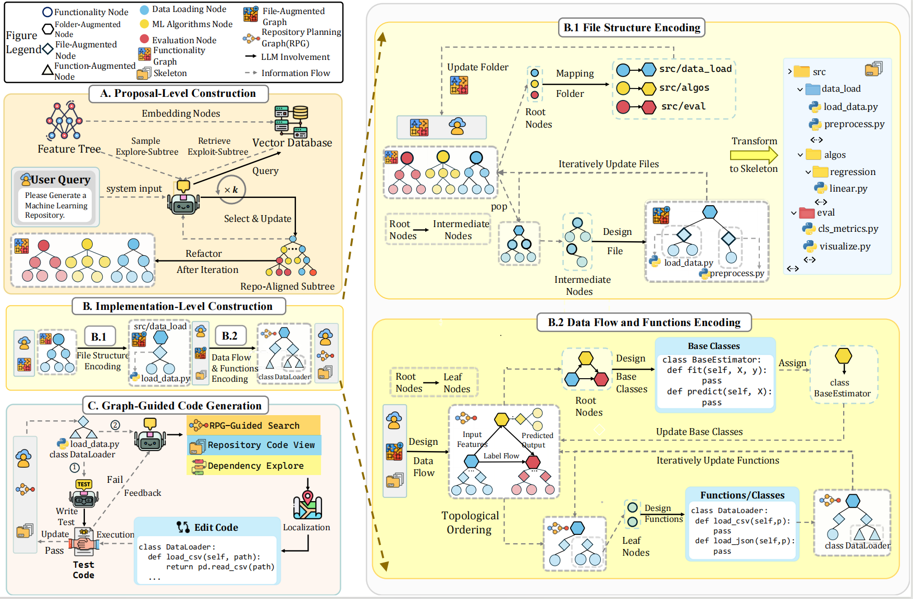

# RPG-ZeroRepo

**RPG-ZeroRepo turns Repository Planning Graphs into a control layer for long-horizon AI coding agents.**

[](https://arxiv.org/abs/2509.16198)
[](https://arxiv.org/abs/2602.02084)
[](https://arxiv.org/abs/2509.16198)
[](https://arxiv.org/abs/2602.02084)
[](https://www.python.org/downloads/)
[](https://opensource.org/licenses/MIT)

🔥 **New: [CoderMind](CoderMind/) is now open source for Claude Code and GitHub Copilot.**

Coding agents often lose repository-level context across long tasks: requirements drift, architecture decisions disappear, and edits miss hidden dependencies.

CoderMind gives agents a **persistent RPG workspace** so they can plan, generate, understand, and update repositories through a shared graph instead of transient chat history and file search.

The repository also includes the research code: **[ZeroRepo](#zerorepo-requirements--rpg--repository)** implements the forward pipeline (`requirements → RPG → repository`), and **[RPG-Encoder](#rpg-encoder-repository--rpg)** implements the reverse pipeline (`repository → RPG`).

---

## News

- [2026-05-15] 🚀 **CoderMind** is now open source for Claude Code and GitHub Copilot. It uses Repository Planning Graphs as a control layer for long-horizon coding agents, including planning, multi-file generation, repository understanding, and graph-aware updates.
- [2026-05-01] 🎉 **RPG-Encoder** ([*Closing the Loop: Universal Repository Representation with RPG-Encoder*](https://arxiv.org/abs/2602.02084)) has been accepted to **ICML 2026**.
- [2026-03-02] 🚀 We have open-sourced the **EpiCoder Feature Tree** at [Hugging Face](https://huggingface.co/datasets/microsoft/EpiCoder-meta-features), providing structured knowledge for repository planning in **ZeroRepo**.
- [2026-02-27] 🚀 We released the code for [RPG-Encoder](zerorepo/rpg_encoder/) and [RepoCraft](repocraft/).
- [2026-02-02] 🔥 Our paper "[Closing the Loop: Universal Repository Representation with RPG-Encoder](https://arxiv.org/abs/2602.02084)" has been released on arXiv.
- [2026-01-26] 🎉 [RPG-ZeroRepo](https://arxiv.org/abs/2509.16198) was accepted as a poster at ICLR 2026.
- [2025-09-19] 🔥 Our paper "[RPG: A Repository Planning Graph for Unified and Scalable Codebase Generation](https://arxiv.org/abs/2509.16198)" has been released on arXiv.

---

## Documentation

- [CoderMind Guide](CoderMind/README.md) — setup, slash commands, MCP tools
- [CoderMind Commands Reference](CoderMind/docs/commands.md)
- [CoderMind CLI Reference](CoderMind/docs/cli-reference.md)
- [CoderMind Configuration](CoderMind/docs/configuration.md)
- [ZeroRepo Pipeline Details](docs/zerorepo-pipeline.md) — Phase 1/2/3, checkpoint files, configuration
- [RPG-Encoder Module](zerorepo/rpg_encoder/README.md)
- [RepoCraft Benchmark](repocraft/README.md)

---

## CoderMind

CoderMind turns Repository Planning Graphs into a control layer for long-horizon AI coding agents.

> Good planning for coding agents should be grounded, executable, verifiable, and reusable. CoderMind makes the plan a graph, not a transient chat artifact.

CoderMind gives agents such as Claude Code and GitHub Copilot a persistent RPG workspace for planning, generation, repository understanding, and graph-aware editing.


### Why CoderMind?

Coding agents are strong at local edits, but repository-level work requires durable context: requirements, architecture, implementation progress, and dependencies must stay aligned across many steps.

| Without CoderMind | With CoderMind |
|---|---|
| The agent relies on chat history and file search. | The agent works against a structured RPG workspace. |
| Requirements and design decisions drift over long tasks. | Requirements, features, architecture, and files stay connected in the graph. |
| Multi-file generation can become inconsistent. | Generation follows an explicit planning graph. |
| Updates are often local edits without impact analysis. | Edits are planned through affected RPG nodes and dependencies. |
| The repository map is rebuilt mentally every time. | The RPG is searchable, explorable, and reusable across tasks. |

### What can I do with CoderMind?

| Task | Start from | CoderMind workflow | Benefit |
|---|---|---|---|
| **Build a new repository** | A natural-language requirement | Create an RPG plan, refine it into architecture/tasks, then generate code. | A persistent plan for long-horizon multi-file generation. |
| **Understand an existing repository** | An existing codebase | Encode the repo into an RPG workspace, then search, explore, and explain through MCP tools (`search_rpg`, `explore_rpg`, `get_node_detail`). | A structured repository map beyond chat history and file search. |
| **Update an existing repository** | A codebase + change request | Use the RPG to locate affected nodes, plan the edit, and update code and graph together (`/cmind.rpg_edit "..."`). | Graph-aware edits that account for cross-file dependencies. |

### Quick Start

```bash
uv tool install cmind-cli \
  --from "git+https://github.com/microsoft/RPG-ZeroRepo.git#subdirectory=CoderMind"
cmind check
```

**On an existing repository:**

```bash
cd your-existing-repo
cmind init . --encode
# In Claude Code or GitHub Copilot:
# /cmind.rpg_edit  "Add rate limiting to all API endpoints"
```

**Generate a new repository:**

```bash
cmind init my-project
cd my-project
# In Claude Code or GitHub Copilot:
# /cmind.feature_spec  Build a CLI tool for managing Docker containers
# /cmind.feature_build → /cmind.feature_refactor → ... → /cmind.code_gen
```

See [`CoderMind/README.md`](CoderMind/README.md) for the full setup, slash commands, and MCP tools.
Also available in [简体中文](CoderMind/README.zh-CN.md) · [日本語](CoderMind/README.ja-JP.md) · [한국어](CoderMind/README.ko-KR.md) · [हिन्दी](CoderMind/README.hi-IN.md).

### Overview

CoderMind gives Claude Code and GitHub Copilot a **persistent RPG workspace** for repository-level tasks. Instead of relying only on chat history, file search, and local context, the agent can carry repository-level planning state across long tasks.

CoderMind exposes the RPG workspace through three interfaces:

- **CLI setup** — initialize CoderMind in a new or existing repository with `cmind init`.
- **Slash commands** — run build, understand, and update workflows inside the coding agent (`/cmind.feature_spec`, `/cmind.code_gen`, `/cmind.encode`, `/cmind.rpg_edit`, and more).
- **MCP graph tools** — let the agent search, inspect, and traverse RPG nodes during coding (`search_rpg`, `explore_rpg`, `get_node_detail`, `list_rpg_tree`).

CoderMind can keep the RPG in sync with code changes through a post-commit hook, so edits made by the agent or directly in code can be reflected back into the graph.

**Supported agents:** Claude Code (verified), GitHub Copilot (verified).

### CoderMind in action

The graph below was produced by running `/cmind.encode` on this repository:


This illustrates how CoderMind turns an existing repository into an RPG that agents can search, explore, and use for graph-aware edits.

See [`CoderMind/`](CoderMind/) for the full guide.

---

## Standalone research code

ZeroRepo and RPG-Encoder are the standalone research pipelines for constructing RPGs:

```
requirements → RPG → repository      # ZeroRepo
repository → RPG                     # RPG-Encoder
```

CoderMind (above) is the agent-facing layer that uses RPGs from either direction. The components below run **without an agent CLI** — useful for paper reproduction and benchmarking.

| Component | Use it for |
|---|---|
| **[ZeroRepo](#zerorepo-requirements--rpg--repository)** | Reproduce the RPG paper's forward pipeline. |
| **[RPG-Encoder](#rpg-encoder-repository--rpg)** | Reproduce the RPG-Encoder paper's reverse pipeline. |
| **[RepoCraft](#repocraft-benchmark)** | Evaluate repository-level code generation. |

### ZeroRepo: requirements → RPG → repository

> *RPG: A Repository Planning Graph for Unified and Scalable Codebase Generation* — [arXiv:2509.16198](https://arxiv.org/abs/2509.16198), ICLR 2026

ZeroRepo is the forward generation framework. It turns a natural-language project requirement into an RPG, refines the graph into architecture and implementation tasks, and generates a complete repository in dependency-aware order.

Pipeline:

1. **Feature planning** — decompose user requirements into a structured feature tree and component decomposition.
2. **Architecture design** — map features to modules, files, classes, interfaces, and data flows. Build the full RPG.
3. **Graph-guided code generation** — generate interdependent files in dependency order, using the RPG as the persistent execution state.



```bash
python main.py \
  --config configs/zerorepo_config.yaml \
  --checkpoint ../my_project/checkpoints \
  --repo ../my_project/workspace \
  --phase all \
  --resume
```

See [`docs/zerorepo-pipeline.md`](docs/zerorepo-pipeline.md) for phase details, checkpoint files, intermediate file reference, and configuration.

### RPG-Encoder: repository → RPG

> *Closing the Loop: Universal Repository Representation with RPG-Encoder* — [arXiv:2602.02084](https://arxiv.org/abs/2602.02084), ICML 2026

RPG-Encoder closes the loop by mapping existing codebases back into Repository Planning Graphs. The resulting RPG captures both semantic intent and structural dependencies.

This enables agents to:

- understand what each part of the repository is for;
- navigate from features to files/functions and back;
- update RPGs incrementally after code changes;
- use the graph as context for maintenance and editing tasks.

#### Three mechanisms

| Mechanism | Module | Description |
|---|---|---|
| **Encoding** | `rpg_parsing/` | Extracts RPG from raw codebases via semantic lifting, structure reorganization, and artifact grounding |
| **Evolution** | `rpg_parsing/rpg_evolution.py` | Incrementally maintains RPGs via commit-level diff parsing, avoiding full re-encoding after every change |
| **Operation** | `rpg_agent/` | Provides a unified agentic interface (SearchNode, FetchNode, ExploreRPG) for structure-aware navigation |

#### Quick start (standalone)

```bash
python parse_rpg.py parse \
    --repo-dir /path/to/repo \
    --repo-name myrepo \
    --save-dir ./output

# Incrementally update after code changes:
python parse_rpg.py update \
    --repo-dir /path/to/updated/repo \
    --last-repo-dir /path/to/old/repo \
    --load-path ./output/rpg_encoder.json \
    --save-dir ./output
```

See [`zerorepo/rpg_encoder/README.md`](zerorepo/rpg_encoder/README.md) for detailed documentation.

### RepoCraft Benchmark

RepoCraft is the benchmark and evaluation suite for repository-level code generation. It evaluates whether a model can plan and generate repository-scale software artifacts rather than isolated functions.

It consists of **1,052 tasks** across 6 real-world Python projects (scikit-learn, pandas, sympy, statsmodels, requests, django).

| Metric | Description |
|---|---|
| **Coverage** | Proportion of reference feature categories covered |
| **Accuracy** | Pass Rate (unit tests) and Voting Rate (semantic checks) |
| **Code Statistics** | File count, Lines of Code (LOC), Token count |

See [`repocraft/README.md`](repocraft/README.md) for the full pipeline documentation.

---

## Papers

- **RPG / ZeroRepo:** Luo et al., *RPG: A Repository Planning Graph for Unified and Scalable Codebase Generation*, [arXiv:2509.16198](https://arxiv.org/abs/2509.16198), ICLR 2026.
- **RPG-Encoder:** Luo et al., *Closing the Loop: Universal Repository Representation with RPG-Encoder*, [arXiv:2602.02084](https://arxiv.org/abs/2602.02084), ICML 2026.

### Citation

```bibtex
@article{luo2025rpg,
  title={RPG: A Repository Planning Graph for Unified and Scalable Codebase Generation},
  author={Luo, Jane and Zhang, Xin and Liu, Steven and Wu, Jie and Liu, Jianfeng and Huang, Yiming and Huang, Yangyu and Yin, Chengyu and Xin, Ying and Zhan, Yuefeng and others},
  journal={arXiv preprint arXiv:2509.16198},
  year={2025}
}

@article{luo2026closing,
  title={Closing the Loop: Universal Repository Representation with RPG-Encoder},
  author={Luo, Jane and Yin, Chengyu and Zhang, Xin and Li, Qingtao and Liu, Steven and Huang, Yiming and Wu, Jie and Liu, Hao and Huang, Yangyu and Kang, Yu and others},
  journal={arXiv preprint arXiv:2602.02084},
  year={2026}
}
```

---

## Acknowledgements

We thank the following projects for inspiration and valuable prior work that helped shape this project:

- [Trae Agent](https://github.com/bytedance/trae-agent)
- [GitHub Spec-Kit](https://github.com/github/spec-kit) — foundation for CoderMind's CLI and slash command structure

## License

MIT License — see [LICENSE](LICENSE) for details.
